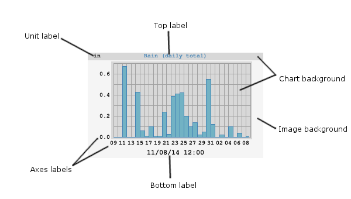
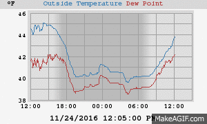
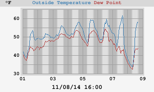

# [ImageGenerator]

This section describes the various options available to the image
generator.

<figure markdown>
  
  <figcaption>Parts of a WeeWX plot image</figcaption>
</figure>

## General options

These are options that affect the overall image.

#### anti_alias

Setting to 2 or more might give a sharper image, with fewer jagged
edges. Experimentation is in order. Default is `1`.

<figure markdown>
  
  <figcaption>A GIF showing the same image with `anti_alias=1`, `2`, and `4`.</figcaption>
</figure>

#### chart_background_color

The background color of the chart itself. Optional. Default is
`#d8d8d8`.

#### chart_gridline_color

The color of the chart grid lines. Optional. Default is `#a0a0a0`

<figure markdown>
  
  <figcaption>Example of day/night bands in a one week image</figcaption>
</figure>

#### daynight_day_color

The color to be used for the daylight band. Optional. Default is
`#ffffff`.

#### daynight_edge_color

The color to be used in the transition zone between night and day.
Optional. Default is `#efefef`, a mid-gray.

#### daynight_night_color

The color to be used for the nighttime band. Optional. Default is
`#f0f0f0`, a dark gray.

#### image_background_color

The background color of the whole image. Optional. Default is
`#f5f5f5` ("SmokeGray")

#### image_width
#### image_height

The width and height of the image in pixels. Optional. Default is 300 x
180 pixels.

#### show_daynight

Set to `true` to show day/night bands in an image. Otherwise, set
to false. This only looks good with day or week plots. Optional. Default
is `false`.

#### skip_if_empty

If set to `true`, then skip the generation of the image if all
data in it are null. If set to a time period, such as `month` or
`year`, then skip the generation of the image if all data in that
period are null. Default is `false`.

#### stale_age

Image file staleness age, in seconds. If the image file is older than
this age it will be generated. If no `stale_age` is specified,
then the image file will be generated every time the generator runs.

#### unit

Normally, the unit used in a plot is set by whatever [unit group the
types are in](../../custom/custom-reports.md#mixed-units). However,
this option allows overriding the unit used in a specific plot.

## Label options

These are options for the various labels used in the image.

#### axis_label_font_color

The color of the x- and y-axis label font. Optional. Default is
`black`.

#### axis_label_font_path

The path to the font to be used for the x- and y-axis labels. Optional.
If not given, or if WeeWX cannot find the font, then the default PIL
font will be used.

#### axis_label_font_size

The size of the x- and y-axis labels in pixels. Optional. The default is
`10`.

#### bottom_label_font_color

The color of the bottom label font. Optional. Default is `black`.

#### bottom_label_font_path

The path to the font to be used for the bottom label. Optional. If not
given, or if WeeWX cannot find the font, then the default PIL font will
be used.

#### bottom_label_font_size

The size of the bottom label in pixels. Optional. The default is
`10`.

#### bottom_label_format

The format to be used for the bottom label. It should be a [strftime
format](https://docs.python.org/3/library/datetime.html#strftime-strptime-behavior).
Optional. Default is `'%m/%d/%y %H:%M'`.

#### bottom_label_offset

The margin of the bottom label from the bottom of the plot. Default is
3.

#### top_label_font_path

The path to the font to be used for the top label. Optional. If not
given, or if WeeWX cannot find the font, then the default PIL font will
be used.

#### top_label_font_size

The size of the top label in pixels. Optional. The default is
`10`.

#### unit_label_font_color

The color of the unit label font. Optional. Default is `black`.

#### unit_label_font_path

The path to the font to be used for the unit label. Optional. If not
given, or if WeeWX cannot find the font, then the default PIL font will
be used.

#### unit_label_font_size

The size of the unit label in pixels. Optional. The default is
`10`.

#### x_interval

The time interval in seconds between x-axis tick marks. Optional. If not
given, a suitable default will be chosen.

#### x_label_format

The format to be used for the time labels on the x-axis. It should be a
[strftime
format](https://docs.python.org/3/library/datetime.html#strftime-strptime-behavior).
Optional. If not given, a sensible format will be chosen automatically.

#### x_label_spacing

Specifies the ordinal increment between labels on the x-axis: For
example, 3 means a label every 3rd tick mark. Optional. The default is
`2`.

#### y_label_side

Specifies if the y-axis labels should be on the left, right, or both
sides of the graph. Valid values are `left`, `right` or `both`. Optional. 
Default is `left`.

#### y_label_spacing

Specifies the ordinal increment between labels on the y-axis: For
example, 3 means a label every 3rd tick mark. Optional. The default is
`2`.

#### y_nticks

The nominal number of ticks along the y-axis. The default is
`10`.

## Plot scaling options

#### time_length

The nominal length of the time period to be covered in seconds. Alternatively,
a [duration notation](../durations.md) can be used. The exact length of the
x-axis is chosen by the plotting engine to cover this period. Optional.
Default is `86400` (one day).

#### yscale

A 3-way tuple (`ylow`, `yhigh`, `min_interval`), where `ylow` and `yhigh` are
the minimum and maximum y-axis values, respectively, and `min_interval` is the
minimum tick interval. If set to `None`, the corresponding value will be
automatically chosen. Optional. Default is `None, None, None`. (Choose the
y-axis minimum, maximum, and minimum increment automatically.)

## Compass rose options

<figure markdown>
  
  <figcaption>Example of a vector plot with a compass rose in the lower-left</figcaption>
</figure>

#### rose_label

The label to be used in the compass rose to indicate due North.
Optional. Default is `N`.

#### rose_label_font_path

The path to the font to be used for the rose label (the letter "N,"
indicating North). Optional. If not given, or if WeeWX cannot find the
font, then the default PIL font will be used.

#### rose_label_font_size

The size of the compass rose label in pixels. Optional. The default is
`10`.

#### rose_label_font_color

The color of the compass rose label. Optional. Default is the same color
as the rose itself.

#### vector_rotate

Causes the vectors to be rotated by this many degrees. Positive is
clockwise. If westerly winds dominate at your location (as they do at
mine), then you may want to specify `+90` for this option. This
will cause the average vector to point straight up, rather than lie flat
against the x-axis. Optional. The default is `0`.

## Plot line options

These are options shared by all the plot lines.

#### chart_line_colors

Each chart line is drawn in a different color. This option is a list of
those colors. If the number of lines exceeds the length of the list,
then the colors wrap around to the beginning of the list. Optional. In
the case of bar charts, this is the color of the outline of the bar.
Default is `#0000ff, #00ff00, #ff0000`.
Individual line color can be overridden by using option [`color`](#color).

#### chart_fill_colors

A list of the color to be used as the fill of the bar charts. Optional.
The default is to use the same color as the outline color (option
[`chart_line_colors`](#chart_line_colors)).

#### chart_line_width

Each chart line can be drawn using a different line width. This option
is a list of these widths. If the number of lines exceeds the length of
the list, then the widths wrap around to the beginning of the list.
Optional. Default is `1, 1, 1`.
Individual line widths can be overridden by using option [`width`](#width).

## Individual line options

These are options that are set for individual lines.

#### aggregate_interval

The time period over which the data should be aggregated, in seconds. 
Alternatively, a [duration notation](../durations.md) can be used. 
Required if `aggregate_type` has been set. 

#### aggregate_type

The default is to plot every data point, but this is probably not a good
idea for any plot longer than a day. By setting this option, you can
*aggregate* data by a set time interval. Available aggregation types
include `avg`, `count`, `cumulative`, `diff`, `last`, `max`, `min`, `sum`,
and `tderiv`.

#### color

This option is to override the color for an individual line. Optional.
Default is to use the color in [`chart_line_colors`](#chart_line_colors).

#### data_type

The SQL data type to be used for this plot line. For more information,
see the section *[Including a type more than once in a
plot](../../custom/image-generator.md#include-same-sql-type-2x)*.
Optional. The default is to use the section name.

#### fill_color

This option is to override the fill color for a bar chart. Optional.
Default is to use the color in [`chart_fill_colors`](#chart_fill_colors).

#### label

The label to be used for this plot line in the top label. Optional. The
default is to use the SQL variable name.

#### line_gap_fraction

If there is a gap between data points bigger than this fractional amount
of the x-axis, then a gap will be drawn, rather than a connecting line.
See Section *[Line gaps](../../custom/image-generator.md#line-gaps)*.
Optional. The default is to always draw the line.

#### line_type

The type of line to be used. Choices are `solid` or
`none`. Optional. Default is `solid`.

#### marker_size

The size of the marker. Optional. Default is `8`.

#### marker_type

The type of marker to be used to mark each data point. Choices are
`cross`, `x`, `circle`, `box`, or `none`. Optional. Default is `none`.

#### plot_type

The type of plot for this line. Choices are `line`, `bar`,
or `vector`. Optional. Default is `line`.

#### width

This option is to override the line width for an individual line.
Optional. Default is to use the width in [`chart_line_width`](#chart_line_width).
